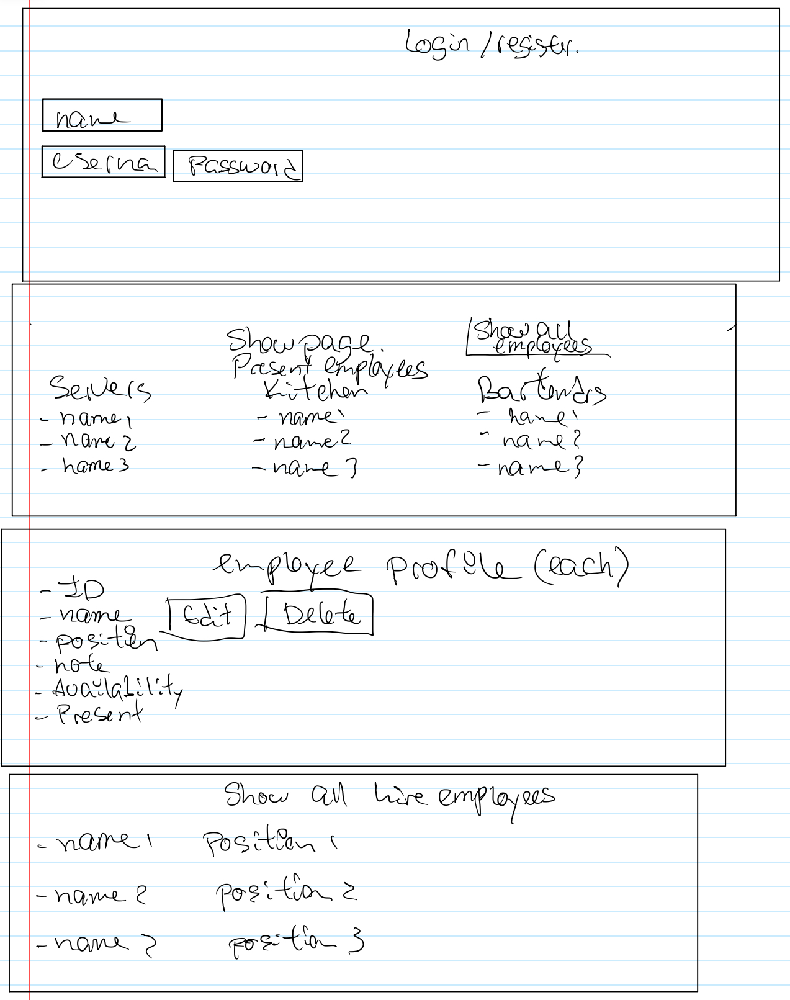

# Project 3
Employee Management Software

## User Story

Employer should be able to login. 
- Be able to see information of the present employees at the moment of login. 
- Be able to click on each employee and see that employee information
(name, position, notes, availability, present and shift).
- Be able to see all the employees listed by name.
- Be able to edit the information of each employee.
- Be able to add new employees.
- Be able to delete employees. 
- Be able to add shift (breakfast, lunch, dinner, brunch).
- Be able to assign shifts to employees. 

## Data

Employee Table

- ID
- Name
- Position
- Notes
- Availability
- Present 
- Shift_ID
- (Picture)
- (How long have been working) (store data as start date)

Employer Table

- ID
- Name
- Username
- Password
- (Picture)

Shift Table

- ID
- Name
- Start
- End
- Notes
- Employee_ID

WhosWorking Table

- ID
- Employee_ID
- Shift_ID (enum)
- Date

## Wireframe

